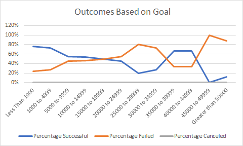

# Kickstarting with Excel

## Overview of Project

### Purpose
#### This study analyzes launch date and funding goal data to determine if fundraising campaigns are successful. The results will support Louise as she is progressing through her own fundraising campaign (which is close to reaching its goal!) for her play _Fever_. Louise requested this study in order to determine the likelihood of her own campaign’s success.

## Analysis and Challenges

### Analysis of Outcomes Based on Launch Date
This analysis is our Deliverable 1. To analyze the outcomes based on the Launch Date, we added a Years column (in the Kickstarter sheet) to reflect the year of the Launch Dates. Then after inserting a pivot table, we assembled a table with outcomes as columns and launch date months as rows. Parent Category (with theater selected) and Years were added as filters as well.

From this pivot table, we inserted a line graph and added a title. This is the resulting line graph that is also saved as Theater_Outcomes_vs_Launch in the Resources folder.

### Analysis of Outcomes Based on Goals
This analysis is our Deliverable 2. This analysis was only for the play subcategory. To begin, we opened a new worksheet. Then, we added columns to represent fundraising goal ranges and titled columns as “Number [outcome]”, “Total Projects”, and “Percentage [outcome]”. Utilizing the COUNTIFS function, we were able to enter input into the empty cells under all the Number and Total Projects columns – this formula included the play subcategory as criteria. Next, we were able to complete the remaining empty cells with a simple division formula in which we took the appropriate number value cell divided by the appropriate total projects value cell. The resulting number was converted to a percentage format.

 

By highlighting the Goal Column and the Percentage columns (columns A, F, G, and H), we inserted a line graph and added a title. This is the resulting line graph that is also saved as Outcomes_vs_Goals in the Resources folder.
 

### Challenges and Difficulties Encountered
In this module, I find using pivot tables the most challenging. Choosing the fields and input in the areas (such as Filters, Columns, Rows, and Values) has not completely clicked in my mind yet. For Deliverable 1, I experimented with different fields in the areas until I had the table that I was looking for. A few paragraphs later in the deliverable description, there was a screenshot of what our table should look like and that screenshot was helpful verification that I used the pivot table correctly. 

In Deliverable 2, I did not know how to do the COUNTIF formula – however, the hint that provided a link (also included here) with instructions was helpful. 
https://support.microsoft.com/en-us/office/countifs-function-dda3dc6e-f74e-4aee-88bc-aa8c2a866842?ui=en-us&rs=en-us&ad=us

## Results

- What are two conclusions you can draw about the Outcomes based on Launch Date?

  At any launch month of the year, theater campaign successful outcomes are more common than failed or canceled outcomes. 

  Launch month of May has the most theater campaign successful outcomes of any launch month in the year.

- What can you conclude about the Outcomes based on Goals?

	For Goals less than $15000, play campaign outcomes are most often successes rather than fails. 

	Other than the $35000 – $44999 range, if a goal is greater than $15000, play campaigns are most often fails rather than successes.

- What are some limitations of this dataset?

  When sifting through the data for the Theater Outcomes Based on Launch Date pivot table, I noticed that if you filter to any year before 2015, that there’s not enough data to represent the entire year from January to December. Additionally, before the year 2014, there’s no failed or canceled outcomes. Realistically speaking, it’s very unlikely that there were only successful campaigns from the years 2010 – 2013. Although, there’s only data for successful outcomes from the years 2010-2013, these years only encompass 26 outcomes and so including these outcomes will probably not skew the line graph much. However, the line graph is probably not an accurate representation of the years 2010-Present (Present is understood to be the beginning of 2017). A possible solution would be to remove the 26 outcomes and have the line graph just represent the years 2014-Present (beginning of 2017).

- What are some other possible tables and/or graphs that we could create?

  The analysis that we did for Outcomes Based on Launch Date represented the Theater parent category. However, the analysis of Outcomes Based on Goals only represented the Plays subcategory within the Theater parent category – the Musicals and Spaces subcategories were excluded. Because of this, we’re not able to fairly relate the two graphs to each other. To fix this, we could create an Outcomes based on Launch Date line graph for the plays Subcategory and an Outcomes Based on Goals line graph for the Theater parent category.

